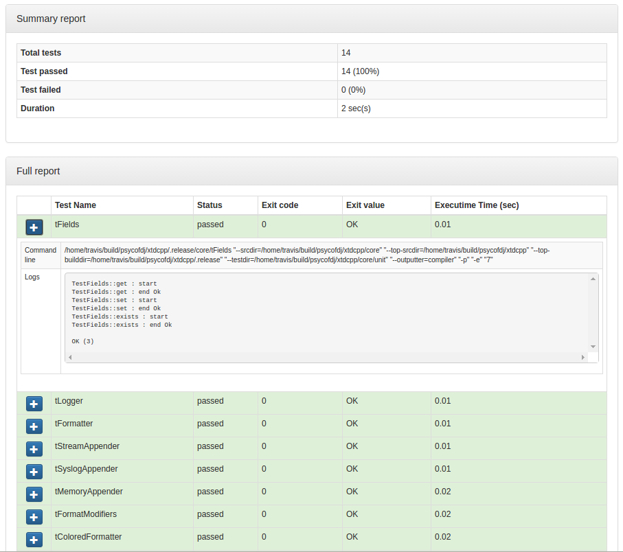

.. _CheckRule:

---------
CheckRule
---------

.. contents::
   :local:

Prerequisites
-------------

enable_testing()
  This module requires that ``enable_testing()`` is called at top level CMakeLists.txt.

xsltproc
  XSL Template rendering tool. Available from ubuntu packages or from
  source at http://xmlsoft.org/

Functions
---------

.. code-block:: cmake

  add_check(<module>
    [PATTERNS  <pattern>     [<pattern>   ...]]
    [INCLUDES  <dir>         [<dir>       ...]]
    [LINKS     <lib>         [<lib>       ...]]
    [ENV       <key>=<value> [<key=value> ...]]
    [ARGS      <arg>         [<arg>       ...]]
    [DIRECTORY <dir>]
    [PREFIX    <str>]
    [JOBS      <int>]
    [NO_DEFAULT_ENV]
    [NO_DEFAULT_ARGS]
    [NO_DEFAULT_INCLUDES]
    [NO_DEFAULT_LINKS]
  )

This function automatically detects tests source files, creates binary targets and generate test
report.

Parameters
----------

module
  Name of the module. It determines the name of the generated cmake
  targets and the directory where targets generate the report.

PATTERNS
  List of file extensions to match while searching for tests. See :ref:`details <CheckRule_matching>`
  about how tests are automatically detected by this module.

  Default value is given by :py:obj:`CheckRule_DEFAULT_PATTERNS`

  .. warning::
    Items given in ``PATTERNS`` list are not wildcards but only file extensions (ie: no asterix)

INCLUDES
  List of include directories to add when compiling test sources. Each item will be
  added through cmake ``target_include_directories`` directive.

  .. warning::
    When using cmake version prior to 2.8.12, test include directories are added through
    cmake ``include_directories``. Therefore, they will also be added to your CMakeLists.txt
    targets.

  Default value is given by :py:obj:`CheckRule_DEFAULT_INCLUDES` unless
  ``NO_DEFAULT_INCLUDES`` option is given.

LINKS
  List of libraries to add when linking test binaries. Each item will be
  added through cmake ``target_link_directories`` directive.

  Default value is given by :py:obj:`CheckRule_DEFAULT_LINKS` unless
  ``NO_DEFAULT_LINKS`` option is given.

ENV
  List of environment variable to defined before running each test.

  Default value is given by :py:obj:`CheckRule_DEFAULT_ENV` unless
  ``NO_DEFAULT_ENV`` option is given.

ARGS
  List of command-line options to pass when running test binaries.

  Default value is given by :py:obj:`CheckRule_DEFAULT_ARGS` unless
  ``NO_DEFAULT_ARGS`` option is given.

  .. tip::
    This option is a convenient way to give your tests some informations about
    source and build directory tree.

  Default value is given :py:obj:`CheckRule_DEFAULT_ARGS`

DIRECTORY
  Directory to search tests source files. See :ref:`details <CheckRule_matching>`
  about how tests are automatically detected by this module.

  Default value is given :py:obj:`CheckRule_DEFAULT_DIRECTORY`

PREFIX
  Filename prefix of test source files. See :ref:`details <CheckRule_matching>`
  about how tests are automatically detected by this module.

  Default value is given :py:obj:`CheckRule_DEFAULT_PREFIX`

JOBS
  Number of simultaneous test to run when target is called.

  Default value is given :py:obj:`CheckRule_DEFAULT_JOBS`

NO_DEFAULT_ENV
  If option is given, don't use :py:obj:`CheckRule_DEFAULT_ENV`

NO_DEFAULT_ARGS
  If option is given, don't use :py:obj:`CheckRule_DEFAULT_ARGS`

NO_DEFAULT_INCLUDES
  If option is given, don't use :py:obj:`CheckRule_DEFAULT_INCLUDES`

NO_DEFAULT_LINKS
  If option is given, don't use :py:obj:`CheckRule_DEFAULT_LINKS`

Global variables
----------------

.. py:attribute:: CheckRule_DEFAULT_PATTERNS
                  ".c;.cc;.cpp"
.. py:attribute:: CheckRule_DEFAULT_INCLUDES
                  ""
.. py:attribute:: CheckRule_DEFAULT_LINKS
                  ""
.. py:attribute:: CheckRule_DEFAULT_ENV
                  ""
.. py:attribute:: CheckRule_DEFAULT_DIRECTORY
                  "\${CMAKE_CURRENT_SOURCE_DIR}/unit"
.. py:attribute:: Check\Rule_DEFAULT_PREFIX
                  "Test"
.. py:attribute:: CheckRule_DEFAULT_JOBS
                  "1"

.. _CheckRule_matching:

Finding the test sources
------------------------

This module scans given ``DIRECTORY`` for source files prefixed by ``PREFIX`` and matches
one of file extensions given by ``PATTERNS``. Each matched file is considered as a standalone
executable test.

Deducing the target name
------------------------

This function deduces the name of the test from its source file by stripping ``DIRECTORY``,
``PREFIX`` and match extension. Example :

  :file: ./unit/TestApplication.cc
  :DIRECTORY: ./unit
  :PATTERNS: .cc;.cpp.c
  :Deduced name: Application

Generated targets
-----------------

``check``
  generate doc reports for all modules

``check-clean``
  removes doc reports for all modules

``<module>-check``
  generate unittests report for module *<module>*

``<module>-check-build``
  build all test binaries for module *<module>*

``<module>-check-run``
  run tests for module *<module>* that are not up-to-date

``<module>-check-run-verbose``
  run tests for module *<module>* that are not up-to-date with
  ctest verbose output

``<module>-check-run-forced``
  run all tests for module *<module>*

``<module>-check-clean``
  clean test targets for module *<module>*

For each test *<name>*, the function also produces :

``t<name>``
  build individual test binary target *<name>*

``<module>-check-ut-<name>``
  run individual test *<name>*

``<module>-check-ut-<name>-gdb``
  run individual test  *<name>* wrapped in gdb debugger

``<module>-check-ut-<name>-cmd``
  prints individual test command *<name>*

Adding test manually
--------------------

Target Dependencies
-------------------

.. graphviz::

   digraph G {
     node [shape=box, style=filled, fillcolor="#ffff99", fontsize=12];
     "cmake"                        -> "dir(DIRECTORY)"
     "cmake"                        -> "check"
     "cmake"                        -> "check-clean"
     "check"                        -> "<module>-check"
     "check-clean"                  -> "<module>-check-clean"
     "<module>-check"               -> "t<name>"
     "<module>-check"               -> "file_list(DIRECTORY, PREFIX, PATTERNS)"
     "t<name>"                      -> "sources(<name>, INCLUDES, LINKS)"
     "<module>-check-ut-<name>"     -> "t<name>"
     "<module>-check-ut-<name>-gdb" -> "t<name>"
     "<module>-check-ut-<name>-cmd" -> ""
     "<module>-check-build"         -> "t<name>"
     "<module>-check-run-forced"    -> ""
     "<module>-check-run-verbose"   -> "<module>-check-build"
     "<module>-check-run"           -> "<module>-check-build"
     "<module>-check-run"           -> "<module>-check-run-forced"
   }

.. warning::

  The dependency of cmake build system to the modification time of
  :py:obj:`DIRECTORY` doesn't work with cmake versions  prior to 3.0.
  This mean you must re-run cmake after adding new sources files in
  order to properly update the rule files dependencies.

Generated reports
-----------------

**HTML** : ``reports/<module>/check/index.html``

Bellow an example of generated html report :

**XML** : ``reports/<module>/check/index.xml``

.. code-block:: xml

  <?xml version="1.0" encoding="UTF-8"?>
  <Site BuildName="(empty)"
  	BuildStamp="20161231-1237-Experimental"
  	Name="(empty)"
  	Generator="ctest-3.5.1"
  	CompilerName=""
  	CompilerVersion=""
  	OSName="Linux"
  	Hostname="PSYCO-INTEL"
  	OSRelease="4.4.0-57-generic"
  	OSVersion="#78-Ubuntu SMP Fri Dec 9 23:50:32 UTC 2016"
  	OSPlatform="x86_64"
  	Is64Bits="1"
  	VendorString="GenuineIntel"
  	VendorID="Intel Corporation"
  	FamilyID="6"
  	ModelID="79"
  	ProcessorCacheSize="20480"
  	NumberOfLogicalCPU="16"
  	NumberOfPhysicalCPU="1"
  	TotalVirtualMemory="93"
  	TotalPhysicalMemory="64340"
  	LogicalProcessorsPerPhysical="16"
  	ProcessorClockFrequency="1898.75"
  	>
  	<Testing>
  		<StartDateTime>Dec 31 13:37 CET</StartDateTime>
  		<StartTestTime>1483187874</StartTestTime>
  		<TestList>
  			<Test>./tApplication</Test>
  		</TestList>
  		<Test Status="passed">
  			<Name>tConfigParser</Name>
  			<Path>.</Path>
  			<FullName>./tConfigParser</FullName>
  			<FullCommandLine>/home/psyco/dev/xtdcpp/.release/core/tConfigParser "--srcdir=/home/psyco/dev/xtdcpp/core" "--top-srcdir=/home/psyco/dev/xtdcpp" "--top-builddir=/home/psyco/dev/xtdcpp/.release" "--testdir=/home/psyco/dev/xtdcpp/core/unit" "--outputter=compiler" "-p" "-e" "7"</FullCommandLine>
  			<Results>
  				<NamedMeasurement type="numeric/double" name="Execution Time">
  					<Value>0.0134299</Value>
  				</NamedMeasurement>
  				<NamedMeasurement type="text/string" name="Completion Status">
  					<Value>Completed</Value>
  				</NamedMeasurement>
  				<NamedMeasurement type="text/string" name="Command Line">
  					<Value>/home/psyco/dev/xtdcpp/.release/core/tConfigParser "--srcdir=/home/psyco/dev/xtdcpp/core" "--top-srcdir=/home/psyco/dev/xtdcpp" "--top-builddir=/home/psyco/dev/xtdcpp/.release" "--testdir=/home/psyco/dev/xtdcpp/core/unit" "--outputter=compiler" "-p" "-e" "7"</Value>
  				</NamedMeasurement>
  				<Measurement>
  					<Value>
              TestConfParser::Constructor : start
              TestConfParser::Constructor : end Ok
              TestConfParser::parse : start
              TestConfParser::parse : end Ok
              TestConfParser::get : start
              TestConfParser::get : end Ok
              TestConfParser::search : start
              TestConfParser::search : end Ok
              TestConfParser::setParams : start
              TestConfParser::setParams : end Ok
              TestConfParser::parseFile : start
              TestConfParser::parseFile : end Ok
              OK (6)
            </Value>
  				</Measurement>
  			</Results>
  		</Test>
  		<EndDateTime>Dec 31 13:37 CET</EndDateTime>
  		<EndTestTime>1483187875</EndTestTime>
  		<ElapsedMinutes>0</ElapsedMinutes>
  	</Testing>
  </Site>

**JSON** : ``reports/<module>/check/status.json``

.. code-block:: json

  {
    "status": "success",
    "graphs": [
      {
        "data": {
          "labels": [],
          "datasets": [
            {
              "borderColor": "rgba(51, 204, 51, 0.5)",
              "pointBorderColor": "rgba(31, 122, 31, 1)",
              "yAxisID": "absolute",
              "label": "success tests",
              "backgroundColor": "rgba(51, 204, 51, 0)",
              "pointBackgroundColor": "rgba(31, 122, 31, 1)",
              "data": "%(success)d"
            },
            {
              "borderColor": "rgba(179, 0, 0, 0.5)",
              "pointBorderColor": "rgba(102, 0, 0, 1)",
              "yAxisID": "absolute",
              "label": "failure tests",
              "backgroundColor": "rgba(179, 0, 0, 0)",
              "pointBackgroundColor": "rgba(102, 0, 0, 1)",
              "data": "%(failures)d"
            }
          ]
        },
        "type": "line",
        "options": {
          "scales": {
            "xAxes": [
              {
                "ticks": {
                  "fontSize": 12,
                  "minRotation": 80
                }
              }
            ],
            "yAxes": [
              {
                "position": "left",
                "ticks": {
                  "fontSize": 24,
                  "beginAtZero": true
                },
                "type": "linear",
                "id": "absolute",
                "display": true
              }
            ]
          },
          "title": {
            "text": "%(module)s : unittests",
            "display": true
          }
        }
      }
    ],
    "data": {
      "failures": 0,
      "success": 14
    },
    "label": "14 / 14"
  }
..
   Local Variables:
   ispell-local-dictionary: "en"
   End:
