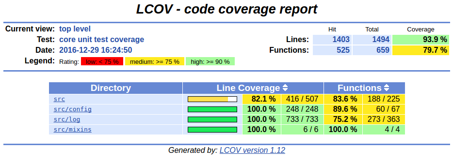

.. _CovRule:

---------------
CovRule
---------------

.. contents::
   :local:

This module generates a report from result of cppcheck static analysis.

Prerequisites
-------------

lcov
  Generates html report from coverage statistics. Available from ubuntu packages or
  from http://ltp.sourceforge.net/coverage/lcov.php

:ref:`CheckRule`
  This module must be enabled in order to load CovRule.

Functions
---------

.. code-block:: cmake

  add_cov(<module>
    [ EXCLUDE_PATTERNS <pattern> [ <pattern> .. ]]
    [ MIN_PERCENT      <value> ]
    [ PREFIX                   ]
  )

This function generates cmake targets that produce reports that show your code coverage.
Generated targets are added as dependency of the global ``cov`` and ``doc-clean``
targets.

Parameters
----------

module
  Name of the module. It determines the name of the generated cmake
  targets and the directory where targets generate the report.

EXCLUDE_PATTERNS
  List of files patterns to exclude from for coverage measurements.

  Default value is given by :py:obj:`CovRule_DEFAULT_EXCLUDE_PATTERNS`.

MIN_PERCENT
  Minimal percent of line coverage to consider target as successful. The target itself won't fail
  but generated JSON status will be tagged as failure.

  Default value is given by :py:obj:`CovRule_DEFAULT_MIN_PERCENT`.

Global variables
----------------

.. py:attribute:: CovRule_DEFAULT_EXCLUDE_PATTERNS
                  "Test*.*"
.. py:attribute:: CovRule_DEFAULT_MIN_PERCENT
                  "30"

Generated targets
-----------------

``cov``
  generate coverage reports for all modules

``cov-clean``
   removes coverage reports for all modules

``<module>-cov``
  generate coverage report for module *<module>*

``<module>-cov-clean``
  removes coverage report for module *<module>*

Dependencies
------------

.. graphviz::

   digraph G {
     rankdir="LR";
     node [shape=box, style=filled, fillcolor="#ffff99", fontsize=12];
     "cov" -> "<module>-cov"
     "<module>-cov" -> "<module>-check-build"
     "<module>-cov" -> "<module>-check-run-forced"
   }

Generated reports
-----------------

**HTML** : ``reports/coverage/<module>/index.html``

Bellow an example of generated html report :

**XML** : ``reports/coverage/<module>/coverage.xml``

.. code-block:: xml

  <?xml version="1.0" ?>
  <!DOCTYPE coverage
    SYSTEM 'http://cobertura.sourceforge.net/xml/coverage-04.dtd'>
  <coverage branch-rate="0.0" branches-covered="0" branches-valid="0" complexity="0" line-rate="0.939089692102" lines-covered="1403" lines-valid="1494" timestamp="1483189103" version="2.0.3">
  	<sources>
  		<source>.</source>
  	</sources>
  	<packages>
  		<package branch-rate="0.0" complexity="0" line-rate="1.0" name="......core.src.config">
  			<classes>
  				<class branch-rate="0.0" complexity="0" filename="../../core/src/config/Grammar.hxx" line-rate="1.0" name="......core.src.config.Grammar.hxx">
  					<methods>
  						<method branch-rate="0.0" line-rate="0.0" name="xtd::config::impl::Grammar&lt;std::istream_iterator&lt;char, char, std::char_traits&lt;char&gt;, long&gt; &gt;::handleError(boost::spirit::line_pos_iterator&lt;std::istream_iterator&lt;char, char, std::char_traits&lt;char&gt;, long&gt; &gt;, boost::spirit::line_pos_iterator&lt;std::istream_iterator&lt;char, char, std::char_traits&lt;char&gt;, long&gt; &gt;, boost::spirit::line_pos_iterator&lt;std::istream_iterator&lt;char, char, std::char_traits&lt;char&gt;, long&gt; &gt;, boost::spirit::info const&amp;)" signature="">
  							<lines>
  								<line branch="false" hits="0" number="124"/>
  							</lines>
  						</method>
  						<method branch-rate="1.0" line-rate="1.0" name="xtd::config::impl::Grammar&lt;__gnu_cxx::__normal_iterator&lt;char*, std::__cxx11::basic_string&lt;char, std::char_traits&lt;char&gt;, std::allocator&lt;char&gt; &gt; &gt; &gt;::Grammar()" signature="">
  							<lines>
  								<line branch="false" hits="20" number="10"/>
  							</lines>
  						</method>
  					</methods>
  					<lines>
  						<line branch="false" hits="23" number="10"/>
  						<line branch="false" hits="23" number="11"/>
  						<line branch="false" hits="46" number="26"/>
  						<line branch="false" hits="46" number="27"/>
  						<line branch="false" hits="23" number="28"/>
  					</lines>
  				</class>
  			</classes>
  		</package>
  	</packages>
  </coverage>

**JSON** : ``reports/coverage/<module>/status.json``

.. code-block:: json

  {
    "status": "success",
    "graphs": [
      {
        "data": {
          "labels": [],
          "datasets": [
            {
              "borderColor": "rgba(51, 204, 51, 0.5)",
              "pointBorderColor": "rgba(31, 122, 31, 1)",
              "yAxisID": "absolute",
              "label": "covered lines",
              "backgroundColor": "rgba(51, 204, 51, 0)",
              "pointBackgroundColor": "rgba(31, 122, 31, 1)",
              "data": "%(covered)d"
            },
            {
              "borderColor": "rgba(179, 0, 0, 0.5)",
              "pointBorderColor": "rgba(102, 0, 0, 1)",
              "yAxisID": "absolute",
              "label": "total lines",
              "backgroundColor": "rgba(179, 0, 0, 0)",
              "pointBackgroundColor": "rgba(102, 0, 0, 1)",
              "data": "%(total)d"
            },
            {
              "borderColor": "rgba(102, 153, 255, 0.5)",
              "pointBorderColor": "rgba(0, 60, 179, 1)",
              "yAxisID": "percent",
              "label": "% covered lines",
              "backgroundColor": "rgba(102, 153, 255, 0)",
              "pointBackgroundColor": "rgba(0, 60, 179, 1)",
              "data": "int((float(%(covered)d) / float(%(total)d)) * 100)"
            }
          ]
        },
        "type": "line",
        "options": {
          "scales": {
            "xAxes": [
              {
                "ticks": {
                  "fontSize": 12,
                  "minRotation": 80
                }
              }
            ],
            "yAxes": [
              {
                "position": "left",
                "ticks": {
                  "fontSize": 24,
                  "beginAtZero": true
                },
                "type": "linear",
                "id": "absolute",
                "display": true
              },
              {
                "position": "right",
                "ticks": {
                  "max": 100,
                  "fontSize": 24,
                  "beginAtZero": true
                },
                "type": "linear",
                "id": "percent"
              }
            ]
          },
          "title": {
            "text": "%(module)s : coverage",
            "display": true
          }
        }
      }
    ],
    "data": {
      "covered": 1403,
      "total": 1494,
      "percent": "int((float(%(covered)d) / float(%(total)d)) * 100)"
    },
    "label": "93 %"
  }
..
   Local Variables:
   ispell-local-dictionary: "en"
   End:
