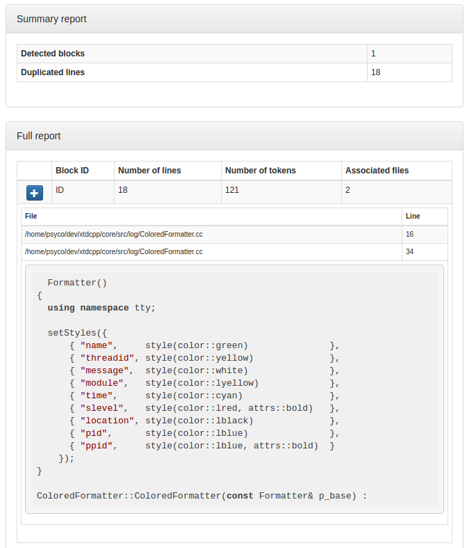

.. _IwyuRule:

--------
IwyuRule
--------

.. contents::
   :local:

This module generates a report that shows detected code duplication blocks.

Prerequisites
-------------

include-what-you-use
  LLVM-based include analyzer. Available from ubuntu packages or from
  source at https://include-what-you-use.org/

Mako
  Python template renderer. Available from ubuntu packages or from source at
  http://www.makotemplates.org/

Functions
---------

.. code-block:: cmake

  add_iwyu(module,
    DEPENDS target1 [target2 ... ],
    [EXCLUDE_PATTERN  <glob>],
    [JOBS             <int>],
    [MAPPING          <file>],
    [VERBOSE]
  )

This function generates cmake targets that produce a report about includes dependencies
for a given module.
Generated targets are added as dependency of the global ``iwyu`` and ``iwyu-clean``
targets.

Parameters
----------

module
  Name of the module. It determines the name of the generated cmake
  targets and the directory where targets generate the report.

INPUT
  List of directories where target should search source files process.
  Default value is given by :py:obj:`IwyuRule_DEFAULT_INPUT`

FILE_PATTERNS
  List of wildcards search files in given input directories.
  Default value is given by :py:obj:`IwyuRule_DEFAULT_FILE_PATTERNS`

EXCLUDE_PATTERNS
  List of regular expressions to exclude matched input files.
  Default value is given by :py:obj:`IwyuRule_DEFAULT_EXCLUDE_PATTERNS`

SUPPRESSIONS
  Path to suppression list.
  Default value is given by :py:obj:`IwyuRule_DEFAULT_SUPPRESSION`

Global variables
----------------

.. py:attribute:: IwyuRule_DEFAULT_PMD_VERSION
                  "5.7.0"

IwyuRule PDM installed version.

.. py:attribute:: IwyuRule_DEFAULT_PMD_HOME
                  "/usr/share/pmd-bin-\${IwyuRule_PMD_VERSION}"

IwyuRule location of PDM installation.

.. py:attribute:: IwyuRule_DEFAULT_INPUT
                  "${CMAKE_CURRENT_SOURCE_DIR}/src"

IwyuRule default list of input source directories

.. py:attribute:: IwyuRule_DEFAULT_FILE_PATTERNS
                  "*.cc;*.hh;*.hxx"

IwyuRule default list of wildcard patterns to search in INPUT directories

.. py:attribute:: IwyuRule_DEFAULT_EXCLUDE_PATTERNS
                  "\${CMAKE_CURRENT_SOURCE_DIR}/unit/.*"

IwyuRule default list of regexp to exclude from analysis

.. py:attribute:: IwyuRule_DEFAULT_MIN_TOKENS
                  "100"

IwyuRule default minimum token length which should be reported as a duplicate

.. py:attribute:: IwyuRule_DEFAULT_ARGS
                  "--skip-lexical-errors"

IwyuRule default additional arguments to give to PMD

.. py:attribute:: IwyuRule_DEFAULT_SUPPRESSION
                  "\${CMAKE_CURRENT_SOURCE_DIR}/src/codedup.suppr"

IwyuRule default path to suppression file

Suppression file
----------------

You may want to squelch some of the duplicated blocks detected by PMD. To do so
can provide a ``json`` file with the following format:

.. code-block:: bash

   [
     <suppression_1>,
     <suppression_2>,
     ...
   ]

where each ``<suppression>`` structure gives instruction to squelch one bloc with
the following format:

.. code-block:: bash

   [
     {
       "file" : "<path-to-file>",
       "from" : <start_line>,
       "to"   : <end_line>
     },
     {
       "file" : "<path-to-file>",
       "from" : <start_line>,
       "to"   : <end_line>
     },
     ...
   ]

Duplicated code block detected by PMD is compared to each ``<suppression>``. When
bloc if found is all given ``files`` between ``from`` and ``to`` lines, the
duplication is squelched.

Generated targets
-----------------

``codedup``
  generate codedup reports for all modules

``codedup-clean``
   removes codedup reports for all modules

``<module>-codedup``
  generate codedup report for module *<module>*

``<module>-codedup-clean``
  removes codedup report for module *<module>*

Dependencies
------------

.. graphviz::

   digraph G {
     rankdir="LR";
     node [shape=box, style=filled, fillcolor="#ffff99", fontsize=12];
     "cmake" -> "dir_list(INPUT)"
     "cmake" -> "codedup"
     "cmake" -> "codedup-clean"
     "codedup" -> "<module>-codedup"
     "<module>-codedup" -> "file_list(INPUT, FILE_PATTERNS) - EXCLUDE_PATTERNS"
     "codedup-clean" -> "<module>-codedup-clean"
   }

.. warning::

  The dependency of cmake build system to the modification time of
  :py:obj:`INPUT` directories doesn't work with cmake versions
  prior to 3.0. This mean you must re-run cmake after adding new sources files in
  order to properly update the rule files dependencies

Generated reports
-----------------

**HTML** : ``reports/codedup/<module>/index.html``

Bellow an example of generated html report :

**XML** : ``reports/codedup/<module>/codedup.xml``

.. code-block:: xml

  <?xml version="1.0" encoding="UTF-8"?>
  <pmd-cpd>
     <duplication lines="18" tokens="121">
        <file line="16" path="/home/psyco/dev/xtdcpp/core/src/log/ColoredFormatter.cc"/>
        <file line="34" path="/home/psyco/dev/xtdcpp/core/src/log/ColoredFormatter.cc"/>
        <codefragment><![CDATA[  Formatter()
  {
    using namespace tty;

    setStyles({
        { "name",     style(color::green)               },
        { "threadid", style(color::yellow)              },
        { "message",  style(color::white)               },
        { "module",   style(color::lyellow)             },
        { "time",     style(color::cyan)                },
        { "slevel",   style(color::lred, attrs::bold)   },
        { "location", style(color::lblack)              },
        { "pid",      style(color::lblue)               },
        { "ppid",     style(color::lblue, attrs::bold)  }
      });
  }

  ColoredFormatter::ColoredFormatter(const Formatter& p_base) :]]></codefragment>
     </duplication>
  </pmd-cpd>

**JSON** : ``reports/codedup/<module>/status.json``

.. code-block:: json

  {
    "status": "failure",
    "index": "index.html",
    "module": "core",
    "label": "1",
    "graphs": [
      {
        "data": {
          "labels": [],
          "datasets": [
            {
              "borderColor": "rgba(179, 0, 0, 0.5)",
              "pointBorderColor": "rgba(102, 0, 0, 1)",
              "yAxisID": "absolute",
              "label": "codedup: # error count",
              "backgroundColor": "rgba(179, 0, 0, 0.5)",
              "pointBackgroundColor": "rgba(102, 0, 0, 1)",
              "data": "%(total)d"
            }
          ]
        },
        "type": "line",
        "options": {
          "scales": {
            "xAxes": [
              {
                "ticks": {
                  "fontSize": 12,
                  "minRotation": 80
                }
              }
            ],
            "yAxes": [
              {
                "position": "left",
                "ticks": {
                  "fontSize": 24,
                  "beginAtZero": true
                },
                "type": "linear",
                "id": "absolute",
                "display": true
              }
            ]
          },
          "title": {
            "text": "%(module)s : codedup",
            "display": true
          }
        }
      }
    ],
    "kpi": "codedup",
    "data": {
      "total": 1
    }
  }
..
   Local Variables:
   ispell-local-dictionary: "en"
   End:

