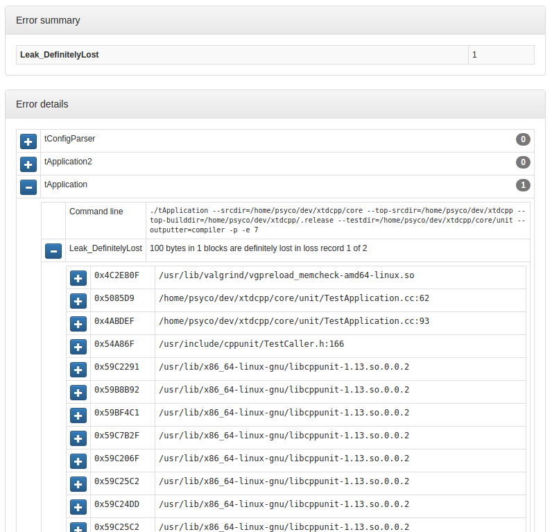

.. _MemcheckRule:

---------------
MemcheckRule
---------------

.. contents::
   :local:

This module generates a report that shows memory defects detected by valgrind for
available unit tests.

Prerequisites
-------------

valgrind
  Instrumentation framework for building dynamic analysis tools. Available from ubuntu
  packages or from source at http://valgrind.org/

:ref:`CheckRule`
  This module must be enabled in order to load MemcheckRule.

Functions
---------

.. code-block:: cmake

  add_memcheck(<module>
  [SUPPRESSIONS <file> [<file> ... ]]
  [EXTRA_ARGS   <args>]
  )

This function generates cmake targets that produce reports that show memory flaws
detected by valgrind on module's test suite. Generated targets are added as dependency
of the global ``memcheck`` and ``memcheck-clean`` targets.

Parameters
----------

module
  Name of the module. It determines the name of the generated cmake
  targets and the directory where targets generate the report.

SUPPRESSIONS
  List of existing files to add as valgrind supression stacks. See
  http://valgrind.org/docs/manual/manual-core.html#manual-core.suppress

EXTRA_ARGS
  List of additional arguments to pass to valgrind. Use with caution,
  parameters must be compatible with ``--tool=memcheck``.

Generated targets
-----------------

``memcheck``
  generate memory reports for all modules

``memcheck-clean``
   removes memory reports for all modules

``<module>-memcheck``
  generate memory report for module *<module>*

``<module>-memcheck-clean``
  removes memory report for module *<module>*

Dependencies
------------

.. graphviz::

   digraph G {
     rankdir="LR";
     node [shape=box, style=filled, fillcolor="#ffff99", fontsize=12];
     "memcheck" -> "<module>-memcheck"
     "<module>-memcheck" -> "<module>-check-build"
     "<module>-memcheck" -> "<module>-check-run-forced"
   }

Generated reports
-----------------

**HTML** : ``reports/memcheck/<module>/index.html``

Bellow an example of generated html report :

**JSON** : ``reports/memcheck/<module>/memcheck.json``

.. code-block:: json

  {
     "tests" : [
        {
           "args" : {
              "args" : [
                 "--srcdir=/home/psyco/dev/xtdcpp/core",
                 "--top-srcdir=/home/psyco/dev/xtdcpp",
                 "--top-builddir=/home/psyco/dev/xtdcpp/.release",
                 "--testdir=/home/psyco/dev/xtdcpp/core/unit",
                 "--outputter=compiler",
                 "-p",
                 "-e",
                 "7"
              ],
              "bin" : "./tApplication"
           },
           "errors" : [
              {
                 "descr" : "100 bytes in 1 blocks are definitely lost in loss record 1 of 2",
                 "kind" : "Leak_DefinitelyLost",
                 "stack" : [
                    {
                       "line" : "",
                       "ip" : "0x4C2E80F",
                       "fn" : "operator new",
                       "obj" : "/usr/lib/valgrind/vgpreload_memcheck-amd64-linux.so",
                       "file" : "",
                       "dir" : ""
                    },
                    {
                       "dir" : "/home/psyco/dev/xtdcpp/core/unit",
                       "obj" : "/home/psyco/dev/xtdcpp/.release/core/tApplication",
                       "file" : "TestApplication.cc",
                       "line" : "62",
                       "ip" : "0x5085D9",
                       "fn" : "MyApp::MyApp(bool)"
                    },
                    {
                       "obj" : "/home/psyco/dev/xtdcpp/.release/core/tApplication",
                       "file" : "TestApplication.cc",
                       "line" : "93",
                       "ip" : "0x4ABDEF",
                       "fn" : "TestApplication::handleSignal()",
                       "dir" : "/home/psyco/dev/xtdcpp/core/unit"
                    }
                 ]
              }
           ]
        }
     ],
     "stats" : {
        "Leak_DefinitelyLost" : 1
     }
  }

**JSON** : ``reports/memcheck/<module>/status.json``

.. code-block:: json

  {
    "status": "failure",
    "graphs": [
      {
        "data": {
          "labels": [],
          "datasets": [
            {
              "borderColor": "rgba(179, 0, 0, 0.5)",
              "pointBorderColor": "rgba(102, 0, 0, 1)",
              "yAxisID": "absolute",
              "label": "memcheck error count",
              "backgroundColor": "rgba(179, 0, 0, 0.5)",
              "pointBackgroundColor": "rgba(102, 0, 0, 1)",
              "data": "%(total)d"
            }
          ]
        },
        "type": "line",
        "options": {
          "scales": {
            "xAxes": [
              {
                "ticks": {
                  "fontSize": 12,
                  "minRotation": 80
                }
              }
            ],
            "yAxes": [
              {
                "position": "left",
                "ticks": {
                  "fontSize": 24,
                  "beginAtZero": true
                },
                "type": "linear",
                "id": "absolute",
                "display": true
              }
            ]
          },
          "title": {
            "text": "%(module)s : memcheck",
            "display": true
          }
        }
      }
    ],
    "data": {
      "total": 1
    },
    "label": "1"
  }

..
   Local Variables:
   ispell-local-dictionary: "en"
   End:
