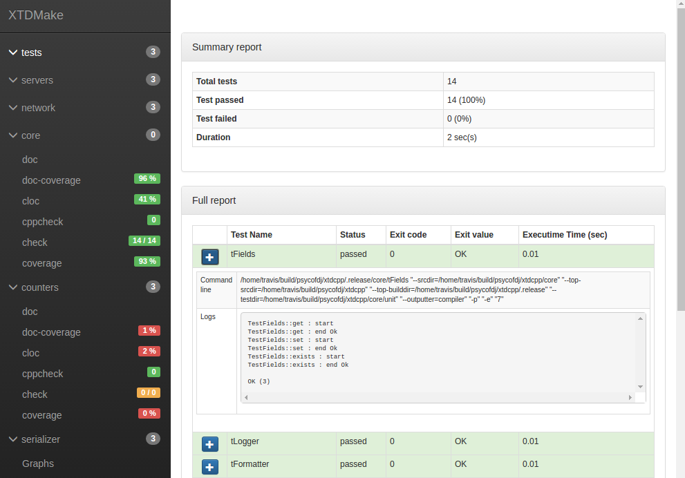
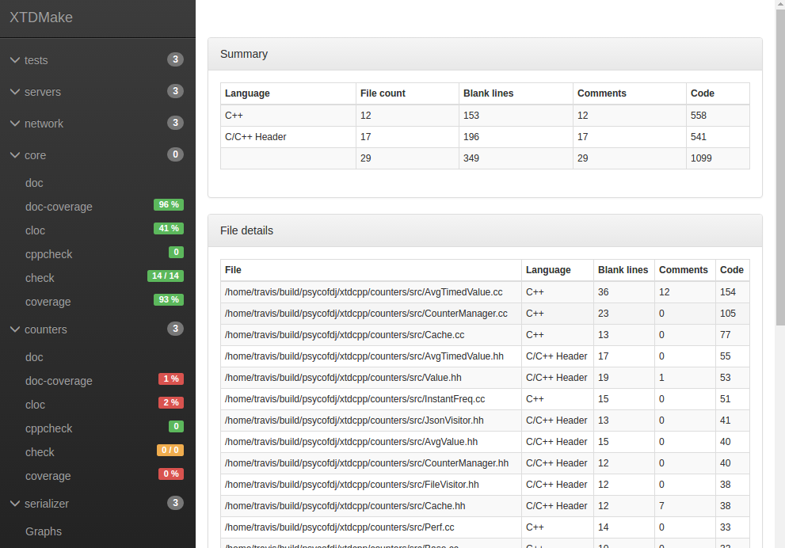
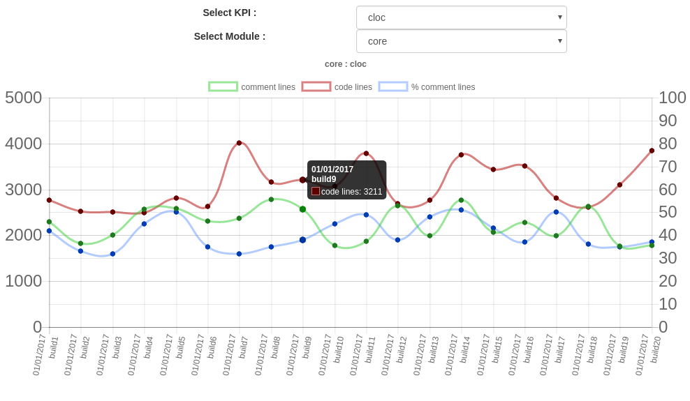

.. _Reports:

-------
Reports
-------

.. contents::
   :local:

This module will gather HTML reports generated by other XTDMake modules in a fancy
HTML interface. This interface allows to navigates from report to report for all
declared modules.

The generated html code is fully static, allowing user to view it directly
in a web browser without any web server installed.

Prerequisites
-------------

Although there is no actual prerequisites to use this module, it's designed to
work with other XTDMake's module that generates HTML reports. If none of them
then are loaded, Report module will work but won't display any valuable information.

Generated Targets
-----------------

``reports``
  run all code quality targets for all modules

``reports-clean``
  clean all generated code quality reports
  
``reports-update``
  (internal use) update report static interface with available generated code
  quality targets

``reports-show``
  opens report interface in default web-browser (ie: sensible-browser)

Dependencies
------------

.. graphviz::

   digraph G {
     rankdir="LR";
     node [shape=box, style=filled, fillcolor="#ffff99", fontsize=12];
     "reports"            -> "doc"
     "reports"            -> "doc-coverage"
     "reports"            -> "cov"
     "reports"            -> "cppcheck"
     "reports"            -> "cloc"
     "reports"            -> "memcheck"
     "reports"            -> "check"
     "reports-clean"      -> "doc-clean"
     "reports-clean"      -> "doc-coverage-clean"
     "reports-clean"      -> "cov-clean"
     "reports-clean"      -> "cppcheck-clean"
     "reports-clean"      -> "cloc-clean"
     "reports-clean"      -> "memcheck-clean"
     "reports-clean"      -> "check-clean"
     "doc"                -> "reports-update"
     "doc-coverage"       -> "reports-update"
     "cov"                -> "reports-update"
     "cppcheck"           -> "reports-update"
     "cloc"               -> "reports-update"
     "memcheck"           -> "reports-update"
     "check"              -> "reports-update"
     "doc-clean"          -> "reports-update"
     "doc-coverage-clean" -> "reports-update"
     "cov-clean"          -> "reports-update"
     "cppcheck-clean"     -> "reports-update"
     "cloc-clean"         -> "reports-update"
     "memcheck-clean"     -> "reports-update"
     "check-clean"        -> "reports-update"
   }

Generated interface
-------------------

**HTML** : ``reports/interface/index.html``

Try live example: https://psycofdj.github.io/xtdcpp/master/

Bellow few screnn shots :

.. image:: _static/reports-1.png
  :align: center

Graph history
-------------

Report module also provides a graph generator tools that allow to keep track of
the code quality measurements in time.

::

  usage: graph [-h] --report-dir REPORT_DIR --history-dir HISTORY_DIR --output-dir OUTPUT_DIR --build-label BUILD_LABEL [--max-items MAX_ITEMS] [--random]

  optional arguments:
    -h, --help                show this help message and exit
    --report-dir REPORT_DIR   path to xtdmake reports
    --history-dir HISTORY_DIR path to history output
    --output-dir OUTPUT_DIR   path to javascript output
    --build-label BUILD_LABEL name of current build
    --max-items MAX_ITEMS     maximum number of build to keep in graph
    --random                  internal use

.. note::

   This tool not run automatically by XTDMake since it has no way to know
   when to pin a new "release".  It's designed to be run in your continuous 
   integration process.

Example of generated graph :

..
   Local Variables:
   ispell-local-dictionary: "en"
   End:
