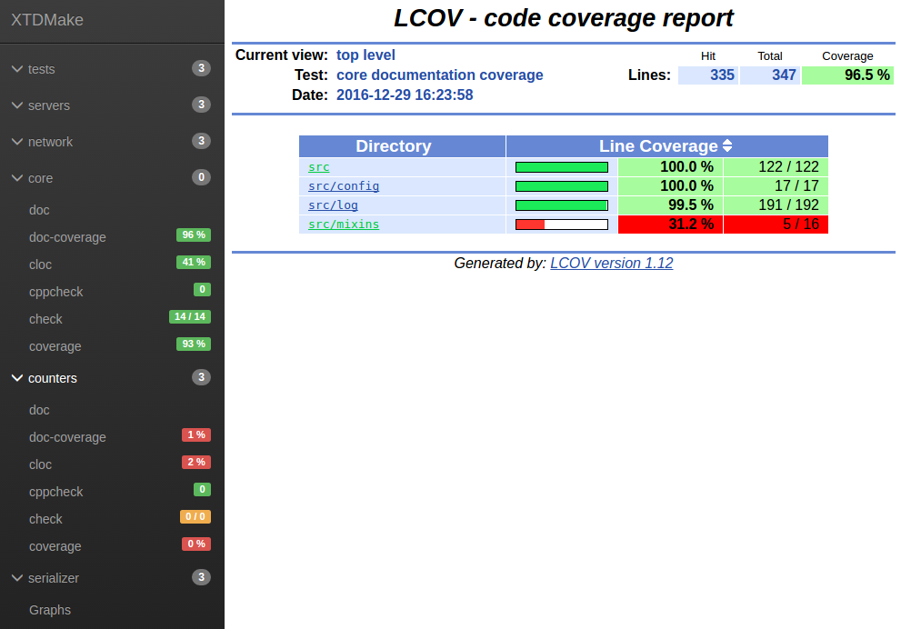

Quick Start
===========

In your root CMakeLists.txt

.. code-block:: cmake

  # ----------
  # cmake init
  # ----------

  cmake_minimum_required(VERSION 2.6)
  project(<project_name>)

  # enabled_testing() must be called at top-level for module CheckRule to work
  # properly
  enable_testing()

  # project's versions must be set for module StaicShared to work properly
  set(PROJECT_VERSION_MAJOR 0)
  set(PROJECT_VERSION_MINOR 1)
  set(PROJECT_VERSION_PATCH 1)

  # ------------
  # load XTDmake
  # ------------

  # All XTDMake global default parameters must be set before calling init function.
  # Ex:
  #   -> list(APPEND CheckRule_DEFAULT_LINKS "${Boost_LIBRARIES}")

  # this function load desisred XTDMake module, each one may or may not be REQUIRED
  xtdmake_init(
    StaticShared    REQUIRED
    DocRule         REQUIRED
    DocCoverageRule REQUIRED
    CppcheckRule    REQUIRED
    CheckRule       REQUIRED
    ClocRule        REQUIRED
    Tracking        REQUIRED
    Cppunit         REQUIRED
    CovRule         REQUIRED
    MemcheckRule    REQUIRED
    CodeDupRule     REQUIRED
    Reports         REQUIRED)

  enable_tracking()

  # ---------------------------
  # rest of your CMakeLists.txt
  # ---------------------------

Load code quality targets
-------------------------

In your module CMakelists.txt, example core/CMakeLists.txt :

.. code-block:: cmake

  include_directories(
    ${Boost_INCLUDE_DIRS}
    ${core_INCLUDE_DIRS}
    )

  # Create both statis and shared libraries using a single call
  add_shared_static_library(core
    src/types.cc
    src/log/Appender.cc
    src/log/ColoredFormatter.cc
    src/log/ConfLoader.cc
    src/log/Formatter.cc
    src/log/helpers.cc
    src/log/Logger.cc
    src/log/MemoryAppender.cc
    src/log/StreamAppender.cc
    src/log/Stream.cc
    src/log/SyslogAppender.cc
    src/log/FormatModifiers.cc
    src/tty.cc
    src/text.cc
    src/Application.cc
    src/config/Parser.cc
    src/config/Grammar.cc
    )

  # enable doxygen documentation
  add_doc(core)

  # enable documentation coverage report
  add_doc_coverage(core)

  # enable count lines of code report
  add_cloc(core)

  # enable cppcheck report
  add_cppcheck(core)

  # enable unittests report
  # link all test to static version on library libcore
  add_check(core
    INCLUDES ./src}
    LINKS    core_s)

  # enable test coverage report
  add_cov(core)

  # enable test memory check report
  add_memcheck(core)

  # enable code duplication report
  add_codedup(core)

Adds some unittests
-------------------

in core/unit/TestMyClass.cc

Run targets
-----------

.. code-block:: bash

  $ cd path-to-build-dir
  $ make reports
  ...
  ...
  ...
  [100%] Built target

  $ make reports-show
  (browser opens on report interface)

Binaries RSC keywords
---------------------

..
   Local Variables:
   ispell-local-dictionary: "en"
   End:
