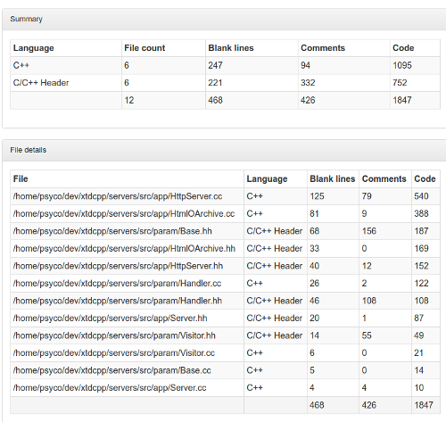

--------
ClocRule
--------

.. contents::
   :local:

Overview
--------

This module generates a report counting the number of code, blank and comments lines
of your module.

**Prerequisites**

:cloc: Count line of code tool. Available from ubuntu packages (>= trusty) or from
   source at http://cloc.sourceforge.net/

:xsltproc: XSL Template rendering tool. Available from ubuntu packages or from
  source at http://xmlsoft.org/

Functions
---------

.. code-block:: cmake

  add_cloc(module_name,
    [INTPUT        <dir>     [ <dir>     ... ]],
    [FILE_PATTERNS <pattern> [ <pattern> ... ]]
  )

This function generates cmake targets that produce cloc reports for a given module.
Generated targets are added as dependency of the global ``cloc`` and ``cloc-clean``
targets.

**Parameters**

.. _ClocRule_module_name:

:module_name: Name of the module. It determines the name of the generated cmake
  targets and the directory where targets generate the report.

.. _ClocRule_INPUT:

:INPUT: List of directories where target should search source files process.
  Default value is given by :ref:`ClocRule_DEFAULT_INPUT <ClocRule_DEFAULT_INPUT>`

.. _ClocRule_FILE_PATTERNS:

:FILE_PATTERNS: List of wildcards search files in given input directories.
  Default value is given by :ref:`ClocRule_DEFAULT_FILE_PATTERNS <ClocRule_DEFAULT_FILE_PATTERNS>`

**Global variables**

.. _ClocRule_DEFAULT_INPUT:

:ClocRule_DEFAULT_INPUT: ``${CMAKE_CURRENT_SOURCE_DIR}/src``

.. _ClocRule_DEFAULT_FILE_PATTERNS:

:ClocRule_FILE_PATTERNS: ``*.cc;*.hh;*.hxx``

Generated rules
---------------

:<module_name>-cloc: generate cloc report for module ``<module_name>``
:<module_name>-cloc-clean: removes cloc report for module ``<module_name>``
:cloc: generate cloc reports for all modules
:cloc-clean: removes cloc reports for all modules

**Dependencies**

.. graphviz::

   digraph G {
     rankdir="LR";
     node [shape=box, style=filled, fillcolor="#ffff99", fontsize=12];
     "cmake" -> "dir_list(INPUT)"
     "cmake" -> "cloc"
     "cmake" -> "cloc-clean"
     "cloc" -> "<module>-cloc"
     "<module>-cloc" -> "file_list(INPUT, FILE_PATTERNS)"
     "cloc-clean" -> "<module>-cloc-clean"
   }

.. warning::

  The dependency of cmake build system to the modification time of
  :ref:`INPUT <ClocRule_INPUT>` directories doesn't work with cmake versions
  prior to 3.0. This mean you must re-run cmake after adding new sources files in
  order to properly update the rule files dependencies

Generated reports
-----------------

**XML** : ``reports/<module_name>/cppcheck/cloc.xml``

.. code-block:: xml

  <?xml version="1.0"?>
  <results>
  <header>
    <cloc_url>http://cloc.sourceforge.net</cloc_url>
    <cloc_version>1.60</cloc_version>
    <elapsed_seconds>0.14513897895813</elapsed_seconds>
    <n_files>43</n_files>
    <n_lines>6476</n_lines>
    <files_per_second>296.267758728031</files_per_second>
    <lines_per_second>44619.302454017</lines_per_second>
    <report_file>/home/psyco/dev/xtdcpp/.release/reports/core/cloc/cloc.xml</report_file>
  </header>
  <files>
    <file name="/home/psyco/dev/xtdcpp/core/src/Application.cc" blank="73" comment="19"  code="349" language="C++" />
    <!-- <file ...> -->
    <total blank="927" comment="2283" code="3266" />
  </files>
  <languages>
    <language name="C++" files_count="17" blank="410" comment="50" code="1981" />
    <language name="C/C++ Header" files_count="26" blank="517" comment="2233" code="1285" />
    <total sum_files="43" blank="927" comment="2283" code="3266" />
  </languages>
  </results>

**HTML** : ``reports/<module_name>/cppcheck/index.html``

Bellow an example of generated html report :

**JSON** : ``reports/<module_name>/cppcheck/status.json``

.. code-block:: json

  {
    "status": "success", 
    "graphs": [
      {
        "data": {
          "labels": [], 
          "datasets": [
            {
              "borderColor": "rgba(51, 204, 51, 0.5)", 
              "pointBorderColor": "rgba(31, 122, 31, 1)", 
              "yAxisID": "absolute", 
              "label": "comment lines", 
              "backgroundColor": "rgba(51, 204, 51, 0)", 
              "pointBackgroundColor": "rgba(31, 122, 31, 1)", 
              "data": "%(comment)d"
            }, 
            {
              "borderColor": "rgba(179, 0, 0, 0.5)", 
              "pointBorderColor": "rgba(102, 0, 0, 1)", 
              "yAxisID": "absolute", 
              "label": "code lines", 
              "backgroundColor": "rgba(179, 0, 0, 0)", 
              "pointBackgroundColor": "rgba(102, 0, 0, 1)", 
              "data": "%(code)d"
            }, 
            {
              "borderColor": "rgba(102, 153, 255, 0.5)", 
              "pointBorderColor": "rgba(0, 60, 179, 1)", 
              "yAxisID": "percent", 
              "label": "% comment lines", 
              "backgroundColor": "rgba(102, 153, 255, 0)", 
              "pointBackgroundColor": "rgba(0, 60, 179, 1)", 
              "data": "int(float(%(comment)d) / (float(%(comment)d) + float(%(code)d)) * 100)"
            }
          ]
        }, 
        "type": "line", 
        "options": {
          "scales": {
            "xAxes": [
              {
                "ticks": {
                  "fontSize": 12, 
                  "minRotation": 80
                }
              }
            ], 
            "yAxes": [
              {
                "position": "left", 
                "ticks": {
                  "fontSize": 24, 
                  "beginAtZero": true
                }, 
                "type": "linear", 
                "id": "absolute", 
                "display": true
              }, 
              {
                "position": "right", 
                "ticks": {
                  "max": 100, 
                  "fontSize": 24, 
                  "beginAtZero": true
                }, 
                "type": "linear", 
                "id": "percent"
              }
            ]
          }, 
          "title": {
            "text": "%(module)s : cloc", 
            "display": true
          }
        }
      }
    ], 
    "data": {
      "comment": 2283, 
      "code": 3266
    }, 
    "label": "41 %"
  } 

..
   Local Variables:
   ispell-local-dictionary: "en"
   End:
