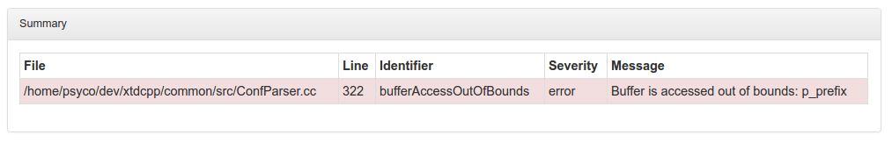

------------
CppcheckRule
------------

.. contents::
   :local:

Overview
--------

This module generates a report from result of cppcheck static analysis.

**Prerequisites**

cppcheck
  Static C++ code analyzer tool. Available from ubuntu packages or from
  source at http://cppcheck.sourceforge.net/

xsltproc
  XSL Template rendering tool. Available from ubuntu packages or from
  source at http://xmlsoft.org/

Functions
---------

.. code-block:: cmake

  add_cppcheck(module_name,
    [INTPUT        <dir>     [ <dir>     ... ]],
    [FILE_PATTERNS <pattern> [ <pattern> ... ]]
  )

This function generates cmake targets that produce cppcheck reports for a given module.
Generated targets are added as dependency of the global ``cppcheck`` and ``cppcheck-clean``
targets.

**Parameters**

module_name
  Name of the module. It determines the name of the generated cmake
  targets and the directory where targets generate the report.

INPUT
  List of directories where target should search source files process.
  Default value is given by :py:obj:`CppcheckRule_DEFAULT_INPUT`

FILE_PATTERNS
  List of wildcards search files in given input directories.
  Default value is given by :py:obj:`CppcheckRule_DEFAULT_FILE_PATTERNS`

**Global variables**

.. py:attribute:: CppcheckRule_DEFAULT_INPUT
                  "${CMAKE_CURRENT_SOURCE_DIR}/src"
.. py:attribute:: CppcheckRule_FILE_PATTERNS
                  "*.cc;*.hh;*.hxx"

Generated rules
---------------

<module_name>-cppcheck
  generate cppcheck report for module ``<module_name>``

<module_name>-cppcheck-clean
  removes cppcheck report for module ``<module_name>``

cppcheck
  generate cppcheck reports for all modules

cppcheck-clean
   removes cppcheck reports for all modules

**Dependencies**

.. graphviz::

   digraph G {
     rankdir="LR";
     node [shape=box, style=filled, fillcolor="#ffff99", fontsize=12];
     "cmake" -> "dir_list(INPUT)"
     "cmake" -> "cppcheck"
     "cmake" -> "cppcheck-clean"
     "cppcheck" -> "<module>-cppcheck"
     "<module>-cppcheck" -> "file_list(INPUT, FILE_PATTERNS)"
     "cppcheck-clean" -> "<module>-cppcheck-clean"
   }

.. warning::

  The dependency of cmake build system to the modification time of
  :py:obj:`INPUT` directories doesn't work with cmake versions
  prior to 3.0. This mean you must re-run cmake after adding new sources files in
  order to properly update the rule files dependencies

Generated reports
-----------------

**XML** : ``reports/<module_name>/cppcheck/cppcheck.xml``

.. code-block:: xml

  <?xml version="1.0" encoding="UTF-8"?>
  <results version="2">
    <cppcheck version="1.72"/>
    <errors>
      <error id="duplicateExpression" severity="style" msg="Same expression on both sides of '<='." verbose="Finding the same expression on both sides of an operator is suspicious and might indicate a cut and paste or logic error. Please examine this code carefully to determine if it is correct.">
        <location file="functions.hh" line="12"/>
        <location file="functions.hh" line="12"/>
      </error>
      <error id="bitwiseOnBoolean" severity="style" msg="Boolean variable 'test1' is used in bitwise operation. Did you mean '&&'?" verbose="Boolean variable 'test1' is used in bitwise operation. Did you mean '&&'?" inconclusive="true">
        <location file="functions.hh" line="22"/>
      </error>
    </errors>
  </results>

**HTML** : ``reports/<module_name>/cppcheck/cppcheck.html``

Bellow an example of generated html report :

**JSON** : ``reports/<module_name>/cppcheck/status.json``

.. code-block:: json

 {
   "status": "success",
   "graphs": [
     {
       "data": {
         "labels": [],
         "datasets": [
           {
             "borderColor": "rgba(179, 0, 0, 0.5)",
             "pointBorderColor": "rgba(102, 0, 0, 1)",
             "yAxisID": "absolute",
             "label": "cppcheck error count",
             "backgroundColor": "rgba(179, 0, 0, 0.5)",
             "pointBackgroundColor": "rgba(102, 0, 0, 1)",
             "data": "%(total)d"
           }
         ]
       },
       "type": "line",
       "options": {
         "scales": {
           "xAxes": [
             {
               "ticks": {
                 "fontSize": 12,
                 "minRotation": 80
               }
             }
           ],
           "yAxes": [
             {
               "position": "left",
               "ticks": {
                 "fontSize": 24,
                 "beginAtZero": true
               },
               "type": "linear",
               "id": "absolute",
               "display": true
             }
           ]
         },
         "title": {
           "text": "%(module)s : cppcheck",
           "display": true
         }
       }
     }
   ],
   "data": {
     "total": 0
   },
   "label": "0"
 }

..
   Local Variables:
   ispell-local-dictionary: "en"
   End:
