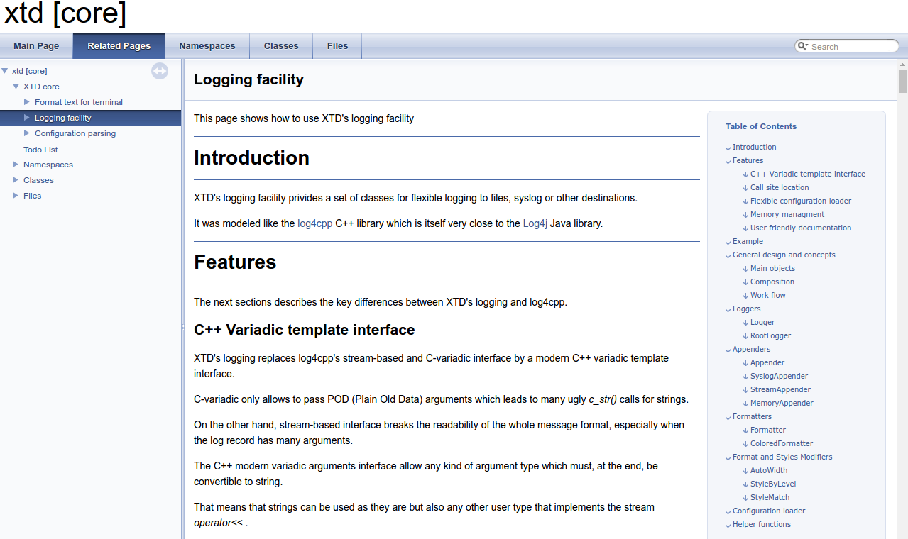

-------
DocRule
-------

.. contents::
   :local:

Overview
--------

This module generates a report from result of cppcheck static analysis.

**Prerequisites**

:doxygen: Code documentation generator for C/C++. Available from ubuntu packages or
  from source at http://www.doxygen.org/

:graphviz: Graph drawing tools, Available from ubuntu packages or
  from source at http://www.graphviz.org/

:Plantuml: UML diagrams drawing tool. Available from ubuntu packages (>= xenial) or
  from source at http://plantuml.com/

Functions
---------

.. code-block:: cmake

  add_doc(module_name,
    [INTPUT            <dir>     [ <dir>     ... ]],
    [FILE_PATTERNS     <pattern> [ <pattern> ... ]]
    [EXCLUDE           <file>    [ <file>    ... ]],
    [PREDEFINED        <name>    [ <name>    ... ]]
    [EXPAND_AS_DEFINED <name>    [ <name>    ... ]]
    [EXAMPLE           <dir> ]
    [PLANTUML]         <jar> ]
    [IMAGE]            <dir> ]
    [WERROR            { YES | NO } ]
    [CALL_GRAPHS       { YES | NO } ]
  )

This function generates cmake targets that produce doxygen documentation for a given
module. Generated targets are added as dependency of the global ``doc`` and
``doc-clean`` targets.

**Parameters**

.. _DocRule_module_name:

:module_name: Name of the module. It determines the name of the generated cmake
  targets and the directory where targets generate the report.

.. _DocRule_INPUT:

:INPUT: List of directories where target should search source files to process.
  Ultimatly this paramter will be given to doxygen ``INPUT`` configuration
  (see https://www.stack.nl/~dimitri/doxygen/manual/config.html#cfg_input).

  Default value is given by :ref:`DocRule_DEFAULT_INPUT <DocRule_DEFAULT_INPUT>`

.. _DocRule_FILE_PATTERNS:

:FILE_PATTERNS: List of wildcards search files in given input directories.
  Ultimatly this paramter will be given to doxygen ``FILE_PATTERNS`` configuration.
  (see https://www.stack.nl/~dimitri/doxygen/manual/config.html#cfg_input).
  Together with :ref:`INPUT <DocRule_INPUT>`, this paramter will determine the
  files dependency of generated target.

  Default value is given by :ref:`DocRule_DEFAULT_FILE_PATTERNS <DocRule_DEFAULT_FILE_PATTERNS>`

.. _DocRule_EXCLUDE:

:EXCLUDE: List of files to exclude from doxygen generation.
  Ultimatly this paramter will be given to doxygen ``EXCLUDE`` configuration.
  (see https://www.stack.nl/~dimitri/doxygen/manual/config.html#cfg_exclude).

  Default value is given by :ref:`DocRule_DEFAULT_EXCLUDE <DocRule_DEFAULT_EXCLUDE>`

.. _DocRule_PREDEFINED:

:EXCLUDE: List of predefined macro given to doxygen in ``PREDEFINED`` configuration
  (see https://www.stack.nl/~dimitri/doxygen/manual/config.html#cfg_predefined).

  Default value is given by :ref:`DocRule_DEFAULT_PREDEFINED <DocRule_DEFAULT_PREDEFINED>`

.. _DocRule_EXPAND_AS_DEFINED:

:EXPAND_AS_DEFINED:
  List of predefined macro given to doxygen in ``EXPAND_AS_DEFINED`` configuration
  (see https://www.stack.nl/~dimitri/doxygen/manual/config.html#cfg_expand_as_defined).

  Default value is given by :ref:`DocRule_DEFAULT_EXPAND_AS_DEFINED <DocRule_DEFAULT_PREDEFINED>`

.. _DocRule_EXAMPLE:

:EXAMPLE: Directory containing examples files given to doxygen as ``EXAMPLE_PATH`` configuration
  (see https://www.stack.nl/~dimitri/doxygen/manual/config.html#cfg_example_path).

  Default value is given by :ref:`DocRule_DEFAULT_EXAMPLE <DocRule_DEFAULT_EXAMPLE>`

.. _DocRule_IMAGE:

:IMAGE: Directory containing images files given to doxygen as ``IMAGE_PATH`` configuration
  (see https://www.stack.nl/~dimitri/doxygen/manual/config.html#cfg_image_path).

  Default value is given by :ref:`DocRule_DEFAULT_IMAGE <DocRule_DEFAULT_IMAGE>`

.. _DocRule_PLANTUML:

:PLANTUML: Path to plantuml jar file given to doxygen as ``PLANTUML_JAR_PATH`` configuration
  (see https://www.stack.nl/~dimitri/doxygen/manual/config.html#cfg_plantuml_jar_path).

  Default value is given by :ref:`DocRule_DEFAULT_PLANTUML <DocRule_DEFAULT_PLANTUML>`

.. warning::
  Plantml integration is not supported in doxygen version prior to 1.8.11. In that case
  this parameter has no effect.

.. _DocRule_WERROR:

:WERROR: If YES, doxygen warning are threated as errors
  (see https://www.stack.nl/~dimitri/doxygen/manual/config.html#cfg_warn_as_error).

  Default value is given by :ref:`DocRule_DEFAULT_WERROR <DocRule_DEFAULT_WERROR>`

.. _DocRule_CALL_GRAPHS:

:CALL_GRAPHS: If YES, doxygen will generate call graph and caller graph. This option
  requires grahviz to be installed.

  Default value is given by :ref:`DocRule_DEFAULT_CALL_GRAPHS <DocRule_DEFAULT_CALL_GRAPHS>`

.. _DocRule_CONFIGURE_TEMPLATE:

:CONFIGURE_TEMPLATE: Path to doxygen configuration template to use. If empty, the function chooses
  one if its own default templates based on currently installed doxygen version.

  Default value is given by :ref:`DocRule_DEFAULT_CONFIG <DocRule_DEFAULT_CONFIG>`

.. warning::
  For XTDMake to work correclty with your manually defined configure template, you must
  insure that :

  * ``GENERATE_XML`` is ``YES`` (required by :ref:`DocCoverageRule` module)
  * ``OUTPUT_DIRECTORY`` is ``@DocRule_OUTPUT@``.

.. tip::
  The following variables are given to the configure template :

  * ``@CMAKE_PROJECT_NAME@``
  * ``@DocRule_MODULE@``
  * ``@DocRule_OUTPUT@``
  * ``@DocRule_WERROR@``
  * ``@DocRule_INPUT@``
  * ``@DocRule_FILE_PATTERNS@``
  * ``@DocRule_EXCLUDE@``
  * ``@DocRule_EXAMPLE@``
  * ``@DocRule_IMAGE@``
  * ``@DocRule_PREDEFINED@``
  * ``@DocRule_EXPAND_AS_DEFINED@``
  * ``@DocRule_CALL_GRAPHS@``
  * ``@DocRule_PLANTUML@``

**Global variables**

.. _DocRule_DEFAULT_EXCLUDE:

:DocRule_DEFAULT_EXCLUDE: ``""``

.. _DocRule_DEFAULT_FILE_PATTERNS:

:DocRule_DEFAULT_FILE_PATTERNS: ``"*.cc;*.hh;*.hpp"``

.. _DocRule_DEFAULT_PREDEFINED:

:DocRule_DEFAULT_PREDEFINED: ``""``

.. _DocRule_DEFAULT_EXPAND_AS_DEFINED:

:DocRule_DEFAULT_EXPAND_AS_DEFINED: ``""``

.. _DocRule_DEFAULT_EXAMPLE:

:DocRule_DEFAULT_EXAMPLE: ``"\${CMAKE_CURRENT_SOURCE_DIR}/doc/example"``

.. _DocRule_DEFAULT_IMAGE:

:DocRule_DEFAULT_IMAGE: ``"\${CMAKE_CURRENT_SOURCE_DIR}/doc/image"``

.. _DocRule_DEFAULT_PLANTUML:

:DocRule_DEFAULT_PLANTUML: ``"/usr/share/plantuml/plantuml.jar"``

.. _DocRule_DEFAULT_INPUT:

:DocRule_DEFAULT_INPUT: ``"\${CMAKE_CURRENT_SOURCE_DIR}/src;\${CMAKE_CURRENT_SOURCE_DIR}/doc"``

.. _DocRule_DEFAULT_WERROR:

:DocRule_DEFAULT_WERROR: ``"YES"``

.. _DocRule_DEFAULT_CALL_GRAPHS:

:DocRule_DEFAULT_CALL_GRAPHS: ``"YES"``

.. _DocRule_DEFAULT_CONFIG:

:DocRule_DEFAULT_CONFIG: ``""``

Generated rules
---------------

:<module_name>-doc: generate doc report for module ``<module_name>``
:<module_name>-doc-clean: removes doc report for module ``<module_name>``
:doc: generate doc reports for all modules
:doc-clean: removes doc reports for all modules

**Dependencies**

.. graphviz::

   digraph G {
     rankdir="LR";
     node [shape=box, style=filled, fillcolor="#ffff99", fontsize=12];
     "cmake" -> "dir_list(INPUT)"
     "cmake" -> "doc"
     "cmake" -> "doc-clean"
     "doc" -> "<module>-doc"
     "<module>-doc" -> "file_list(INPUT, FILE_PATTERNS)"
     "doc-clean" -> "<module>-doc-clean"
   }

.. warning::

  The dependency of cmake build system to the modification time of
  :ref:`INPUT <DocRule_INPUT>` directories doesn't work with cmake versions
  prior to 3.0. This mean you must re-run cmake after adding new sources files in
  order to properly update the rule files dependencies

Generated reports
-----------------

**XML** : ``reports/<module_name>/doc/xml/index.xml``

**HTML** : ``reports/<module_name>/doc/html/index.html``

Bellow an example of generated html report :

..
   Local Variables:
   ispell-local-dictionary: "en"
   End:
