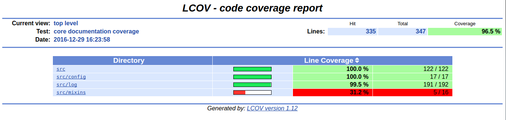
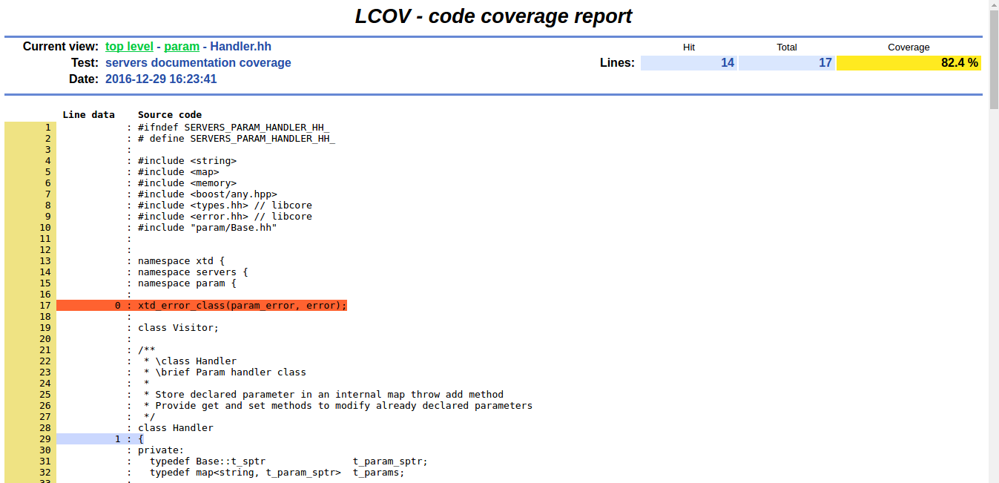

.. _DocCoverageRule:

---------------
DocCoverageRule
---------------

.. contents::
   :local:

This module generates a report from result of cppcheck static analysis.

Prerequisites
-------------

lcov
  Generates html report from coverage statistics. Available from ubuntu packages or
  from http://ltp.sourceforge.net/coverage/lcov.php

coverxygen
  Generate coverage statictics from doxygen xml output. Available from :

  * Ubuntu PPA at https://launchpad.net/~psycofdj/+archive/ubuntu/coverxygen
  * Python Package index : https://pypi.python.org/pypi/coverxygen/
  * Source at https://github.com/psycofdj/coverxygen

:ref:`DocRule`
  This module must be enabled in order to load DocCoverageRule.

Functions
---------

.. code-block:: cmake

  add_doc_coverage(<module>
    [ KIND  <kind>  [<kind>  ...]]
    [ SCOPE <scope> [<scope> ...]]
    [ MIN_PERCENT <value> ]
    [ PREFIX              ]
  )

This function generates cmake targets that produce reports that show your documentation's coverage.
Generated targets are added as dependency of the global ``doc-coverage`` and ``doc-coverage-clean``
targets.

Parameters
----------

module
  Name of the module. It determines the name of the generated cmake
  targets and the directory where targets generate the report.

KIND
  List of symbols to consider for coverage measurements. Available values are described by the
  ``--kind`` parameter of the ``coverxygen`` tools at https://github.com/psycofdj/coverxygen.

  Default value is given by :py:obj:`DocCoverageRule_DEFAULT_KIND`.

SCOPE
  List of scope of symbol to consider for coverage measurements. Available values are described by the
  ``--scope`` parameter of the ``coverxygen`` tools at https://github.com/psycofdj/coverxygen.

  Default value is given by :py:obj:`DocCoverageRule_DEFAULT_SCOPE`.

MIN_PERCENT
  Minimal percent of line coverage to consider target as successful. The target itself won't fail
  but generated JSON status will be tagged as failure.

  Default value is given by :py:obj:`DocCoverageRule_DEFAULT_MIN_PERCENT`.

PREFIX
  Path prefix to remove from files in coverage interface.

  Default value is given by :py:obj:`DocCoverageRule_DEFAULT_PREFIX`.

Global variables
----------------

.. py:attribute:: DocCoverageRule_DEFAULT_KIND
                  "enum;typedef;variable;function;class;struct;define"
.. py:attribute:: DocCoverageRule_DEFAULT_SCOPE
                  "public;protected"
.. py:attribute:: DocCoverageRule_DEFAULT_MIN_PERCENT
                  "30"
.. py:attribute:: DocCoverageRule_DEFAULT_PREFIX
                  "\${CMAKE_CURRENT_SOURCE_DIR}/src"

Generated targets
-----------------

``doc-coverage``
  generate documentation coverage reports for all modules

``doc-coverage-clean``
   removes documentation coverage reports for all modules

``<module>-doc-coverage``
  generate documentation coverage report for module *<module>*

``<module>-doc-coverage-clean``
  removes documentation coverage report for module *<module>*

Dependencies
------------

.. graphviz::

   digraph G {
     rankdir="LR";
     node [shape=box, style=filled, fillcolor="#ffff99", fontsize=12];
     "doc-coverage" -> "<module>-doc-coverage"
     "<module>-doc-coverage" -> "<module>-doc"
   }

Generated reports
-----------------

**HTML** : ``reports/<module>/doc-coverage/index.html``

Bellow an example of generated html report :

**JSON** : ``reports/<module>/doc-coverage/data.json``

.. code-block:: json

  [
    {
      "<path_to_file1>": [
        {
          "line": 53,
          "documented": true,
          "file": "/home/psyco/dev/xtdcpp/core/src/log/Appender.hh",
          "symbol": "xtd::log::Appender::Appender"
        },
        "..."
      ]
    },
    {
      "<path_to_file2>": [
         "..."
      ]
    }
  ]

**JSON** : ``reports/<module>/doc-coverage/status.json``

.. code-block:: json

 {
   "status": "success",
   "graphs": [
     {
       "data": {
         "labels": [],
         "datasets": [
           {
             "borderColor": "rgba(51, 204, 51, 0.5)",
             "pointBorderColor": "rgba(31, 122, 31, 1)",
             "yAxisID": "absolute",
             "label": "documented lines",
             "backgroundColor": "rgba(51, 204, 51, 0)",
             "pointBackgroundColor": "rgba(31, 122, 31, 1)",
             "data": "%(documented)d"
           },
           {
             "borderColor": "rgba(179, 0, 0, 0.5)",
             "pointBorderColor": "rgba(102, 0, 0, 1)",
             "yAxisID": "absolute",
             "label": "total lines",
             "backgroundColor": "rgba(179, 0, 0, 0)",
             "pointBackgroundColor": "rgba(102, 0, 0, 1)",
             "data": "%(total)d"
           },
           {
             "borderColor": "rgba(102, 153, 255, 0.5)",
             "pointBorderColor": "rgba(0, 60, 179, 1)",
             "yAxisID": "percent",
             "label": "% covered lines",
             "backgroundColor": "rgba(102, 153, 255, 0)",
             "pointBackgroundColor": "rgba(0, 60, 179, 1)",
             "data": "int((float(%(documented)d) / float(%(total)d)) * 100)"
           }
         ]
       },
       "type": "line",
       "options": {
         "scales": {
           "xAxes": [
             {
               "ticks": {
                 "fontSize": 12,
                 "minRotation": 80
               }
             }
           ],
           "yAxes": [
             {
               "position": "left",
               "ticks": {
                 "fontSize": 24,
                 "beginAtZero": true
               },
               "type": "linear",
               "id": "absolute",
               "display": true
             },
             {
               "position": "right",
               "ticks": {
                 "max": 100,
                 "fontSize": 24,
                 "beginAtZero": true
               },
               "type": "linear",
               "id": "percent"
             }
           ]
         },
         "title": {
           "text": "%(module)s : doc-coverage",
           "display": true
         }
       }
     }
   ],
   "data": {
     "documented": 335,
     "total": 347
   },
   "label": "96 %"
 }

..
   Local Variables:
   ispell-local-dictionary: "en"
   End:
